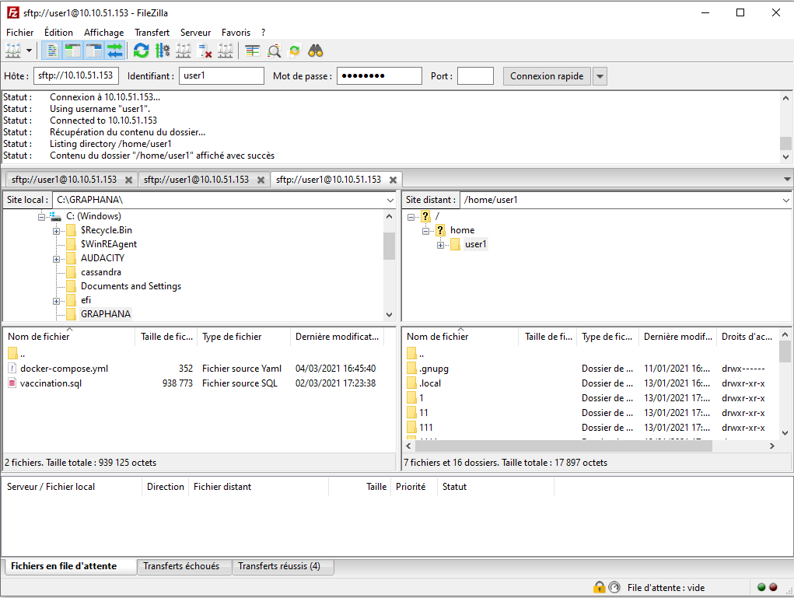
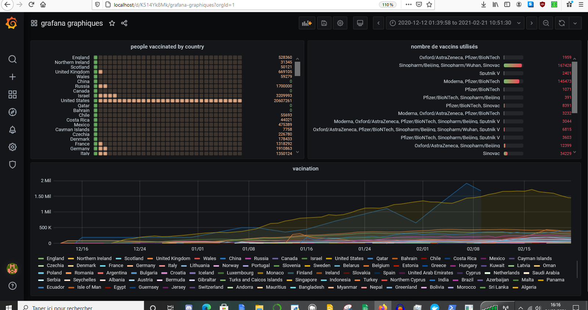

# Un-conteneur-pour-grafana
Mettre en place deux conteneurs (mysql et grafana) sur un serveur à distance accessible via une adresse IP.
  
## Filezzila 
on ouvre Filezzila  et on se connecte 




sous user1 on crée un répertoire brief

dans brief on fait glisser notre table sql : vaccination.sql et notre fichier docker-compose.yml


## Connexion au serveur


  on se connecte sur le serveur de l'isen
  
  
  user1@10.10.51.153
  password:luigipat
  

on se place dans le répertoire brief crée dans Filezzila

PS C:\windows\system32> cd BRIEF


on visualise ce qu'il ya dans les container :

user1@Debian10-Virtu:~/BRIEF$ docker container ls


```CONTAINER ID   IMAGE             COMMAND                  CREATED        STATUS        PORTS                        NAMES
43f918645b15   grafana/grafana   "/run.sh"                17 hours ago   Up 17 hours   0.0.0.0:80->3000/tcp         brief_grafana_1
9c1b612d9689   lavoweb/php-7.1   "docker-php-entrypoi…"   18 hours ago   Up 18 hours   80/tcp, 0.0.0.0:81->81/tcp   user1_web_1
34b388a94732   mysql:5.5         "docker-entrypoint.s…"   18 hours ago   Up 18 hours   0.0.0.0:3306->3306/tcp       user1_db_1
```

on arrête et supprime les containers existants pour créer ceux qui nous intéressent:

user1@Debian10-Virtu:~/BRIEF$ docker stop brief_grafana_1

brief_grafana_1


user1@Debian10-Virtu:~/BRIEF$ docker rm brief_grafana_1

brief_grafana_1

user1@Debian10-Virtu:~/BRIEF$ docker stop user1_web_1

user1_web_1

user1@Debian10-Virtu:~/BRIEF$ docker rm user1_web_1

user1_web_1

user1@Debian10-Virtu:~/BRIEF$ docker stop user1_db_1

user1_db_1

user1@Debian10-Virtu:~/BRIEF$ docker rm user1_db_1

user1_db_1


on verifie que tout soit vide:

user1@Debian10-Virtu:~/BRIEF$ docker container ls

```CONTAINER ID   IMAGE     COMMAND   CREATED   STATUS    PORTS     NAMES
```


on crée nos containers

```user1@Debian10-Virtu:~/BRIEF$ docker-compose up -d

Starting brief_mysql_1   ... done
Creating brief_grafana_1 ... done
```


user1@Debian10-Virtu:~/BRIEF$ docker container ls

```CONTAINER ID   IMAGE             COMMAND                  CREATED          STATUS          PORTS                               NAMES
3faf8916939e   grafana/grafana   "/run.sh"                14 minutes ago   Up 14 minutes   0.0.0.0:80->3000/tcp                brief_grafana_1
afcfdf6045d6   mysql:5.7         "docker-entrypoint.s…"   18 hours ago     Up 14 minutes   0.0.0.0:3306->3306/tcp, 33060/tcp   brief_mysql_1
```

on a bien nos 2 containers en mode run  :

-celui de grafana dont le nom est : brief_grafana_1

-celui de mysql dont le nom est : brief_mysql_1


user1@Debian10-Virtu:~/BRIEF$ docker exec -it brief_mysql_1  bash (nom du container dans lequel on souhaite transférer notrebbd)


## Connexion à mysql


on se connecte à mysql
root@afcfdf6045d6:/# mysql


root@afcfdf6045d6:/# mysql -u root -p
Enter password:myRootPassword123


Welcome to the MySQL monitor.  Commands end with ; or \g.
Your MySQL connection id is 10
Server version: 5.7.33 MySQL Community Server (GPL)

Copyright (c) 2000, 2021, Oracle and/or its affiliates.


## Création de la base de données:

mysql> CREATE DATABASE myDb;


```mysql> SHOW DATABASES;
+--------------------+
| Database           |
+--------------------+
| information_schema |
| myDb               |
| mysql              |
| performance_schema |
| sys                |
| vaccination        |
+--------------------+
6 rows in set (0.00 sec)
```


on se connecte à notre bbd
mysql> use myDb
Database changed


on crée la table :


mysql> source vaccination.sql


on transfére notre bdd (en premier le nom de la bbd et ensuite le nom du container)


user1@Debian10-Virtu:~/BRIEF$ docker cp vaccination.sql brief_mysql_1:/


user1@Debian10-Virtu:~/BRIEF$ docker exec -it brief_mysql_1  bash


root@afcfdf6045d6:/# mysql


mysql> source vaccination.sql


```user1@Debian10-Virtu:~/BRIEF$ docker ps
CONTAINER ID   IMAGE             COMMAND                  CREATED              STATUS              PORTS                               NAMES
5d367105e97f   mysql:5.7         "docker-entrypoint.s…"   About a minute ago   Up About a minute   33060/tcp, 0.0.0.0:3307->3306/tcp   mysql
f696395d1d5c   grafana/grafana   "/run.sh"                About a minute ago   Up About a minute   3000/tcp, 0.0.0.0:81->3001/tcp      grafana
3faf8916939e   grafana/grafana   "/run.sh"                58 minutes ago       Up 58 minutes       0.0.0.0:80->3000/tcp                brief_grafana_1
afcfdf6045d6   mysql:5.7         "docker-entrypoint.s…"   19 hours ago         Up 58 minutes       0.0.0.0:3306->3306/tcp, 33060/tcp   brief_mysql_1
```

nos 2 containers sont les 2 derniers


le port de gauche doit être différent pour chaque container sinon , conflit car les canaux sont les mêmes


## Connexion à grafana


  Soit sur docker, on va dans cli et nous sommes dirigés vers la page internet grafana
  Soit on saisi directement sur internet l'adresse IP du serveur suivi du numéro de notre port
  
  on se connecte à grafana
  
      identifiant :admin
      
      mdp : admin 
      


